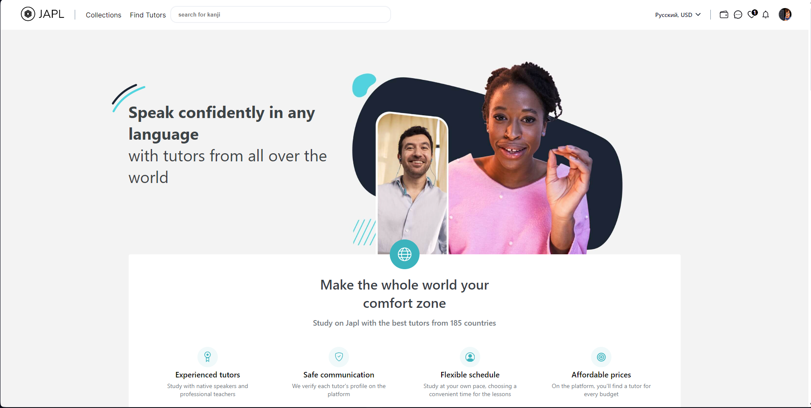

 

  

  

    Project for learning Japanese
     
    <a href="https://github.com/sabaka137/Japl-server"><strong>Japl-backend</strong></a>
     
  

<!-- ABOUT THE PROJECT -->

## About The Project

&nbsp;

Japl is a pet project designed to learn the Japanese language, which incorporates several learning methods.

### Flashcards
Will help you memorize Japanese words, phrases, and kanji characters. You will be able to create your own flashcard sets. Each flashcard will contain a Japanese word, its pronunciation, and translation into your selected language.

### Quiz
Japl also offers the ability to randomly generate tests to assess and reinforce your knowledge in an engaging manner. This method allows you to activate your memory and develop quick recognition and understanding skills in the Japanese language.

### Tutors
If you require assistance from professional tutors, Japl provides a tutor search feature. You will be able to find experienced Japanese language instructors who can help improve your reading, writing, speaking, and comprehension skills in the Japanese language.

### Chat
In addition to all the features mentioned above, Japl also offers a chat function where you can ask questions to different instructors.

(<a href="#readme-top">back to top</a>)

### Built With

&nbsp;
&nbsp;
&nbsp;
&nbsp;
 &nbsp;

(<a href="#readme-top">back to top</a>)

